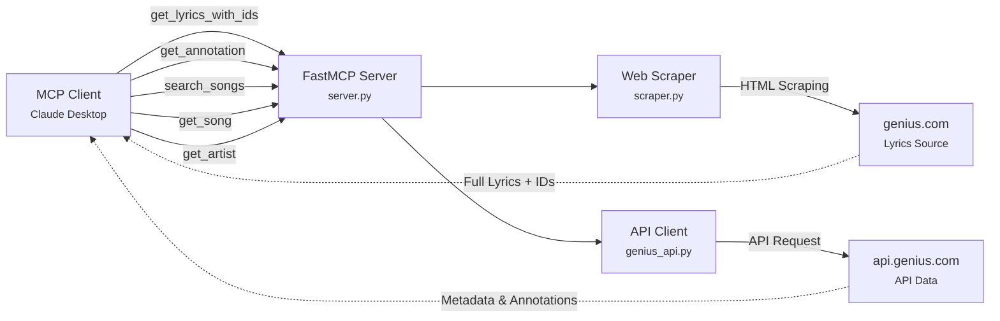

# Genius MCP Server

<div align="center">

[]()
[]()
[]()
[]()

**Retrieve song lyrics, annotations, and detailed music metadata from Genius.com through the Model Context Protocol**

</div>

---

## Overview

The Genius MCP Server enables AI assistants like Claude to fetch complete song lyrics, detailed annotations, and comprehensive music metadata from Genius.com. Perfect for music analysis, lyric interpretation, artist research, and understanding the stories behind your favorite songs.

### How It Works



### Architecture Approach

| Component            | Method        | Reason                                 |
| -------------------- | ------------- | -------------------------------------- |
| **Lyrics Retrieval** | HTML Scraping | Genius API doesn't provide full lyrics |
| **Annotations**      | Official API  | Reliable, structured annotation data   |
| **Song Metadata**    | Official API  | Rich metadata (album, stats, media)    |
| **Artist Info**      | Official API  | Bio, social links, followers           |
| **Search**           | Official API  | Accurate search results                |

## Features

<table>
<tr>
<td width="50%">

### Complete Lyrics Extraction
- Full song lyrics with line-by-line accuracy
- Embedded annotation IDs for context
- Fuzzy search for song/artist names

</td>
<td width="50%">

### Annotation Retrieval
- Detailed lyric explanations
- Context and meaning breakdown
- Community-sourced insights
- Batch processing support

</td>
</tr>
<tr>
<td width="50%">

### Song Metadata
- Album information
- Release dates
- Page view statistics
- Featured artists
- Media links (YouTube, Spotify, etc.)

</td>
<td width="50%">

### Artist Information
- Comprehensive bios
- Social media links
- Follower counts
- Alternate names
- Artist images

</td>
</tr>
</table>

## Quick Start

### Prerequisites

- **Python 3.12 or higher**
- **Genius API Account** (free)

### Installation

#### Step 1: Get Your Genius API Token

1. Visit [Genius API Clients](https://genius.com/api-clients)
2. Log in or create a free Genius account
3. Click **"New API Client"**
4. Fill in the required fields:
   - **App Name**: Choose any name (e.g., "MCP Lyrics Tool")
   - **App Website URL**: Can use `http://localhost` for personal use
   - **Redirect URI**: Can use `http://localhost/callback`
5. Click **"Save"** to create your app
6. On the app page, find and copy your **"Client Access Token"**

#### Step 2: Install Dependencies

```bash
pip install mcp httpx beautifulsoup4 lxml
```

Or using `uv`:

```bash
uv pip install mcp httpx beautifulsoup4 lxml
```

#### Step 3: Configure Your MCP Client
1. Clone or download this repository to a location on your computer
2. Note the full path (e.g., `/Users/yourname/Downloads/genius_mcp`)

**Configuration:**
- **macOS**: `~/Library/Application Support/Claude/claude_desktop_config.json`
- **Windows**: `%APPDATA%\Claude\claude_desktop_config.json`

```json
{
  "mcpServers": {
    "genius": {
      "command": "python3",
      "args": [
        "-m",
        "src.server"
      ],
      "cwd": "/path/to/genius_mcp", 
      "env": {
        "GENIUS_API_TOKEN": "your_genius_api_token_here", 
        "PYTHONPATH": "/path/to/genius_mcp" 
      }
    }
  }
}
```

#### Step 4: Restart Your MCP Client

1. Completely quit Claude Desktop (or your MCP client)
2. Relaunch the application
3. The Genius tools should now appear in your tool list

### 🎉 You're Ready!

Try asking Claude:
- "Show me the lyrics for 'Bohemian Rhapsody' by Queen"
- "Explain the meaning behind the first verse of 'Stan'"
- "Search for songs by Kendrick Lamar"
- "Get details about the song 'HUMBLE.'"
- "Tell me about Eminem as an artist"

## Usage

### Available Tools

#### 1. `get_lyrics_with_ids`

Retrieve complete song lyrics with embedded annotation IDs.

**Parameters:**

| Parameter     | Type   | Required | Description                     |
| ------------- | ------ | -------- | ------------------------------- |
| `song_name`   | string | Yes      | Song title (flexible matching)  |
| `artist_name` | string | Yes      | Artist name (flexible matching) |

**Example Request:**
```python
get_lyrics_with_ids(
    song_name="Rap God",
    artist_name="Eminem"
)
```

**Example Response:**
```
Rap God by Eminem
============================================================

"Look, I was gonna go easy on you" [ID: 2310153]
And I'm only going to get this one chance

"Something's wrong, I can feel it" [ID: 2310156]
(Six minutes—, six minutes—) [ID: 2310030]

"I'm beginning to feel like a Rap God, Rap God" [ID: 2310045]
All my people from the front to the back nod, back nod
...
```
---

#### 2. `get_annotation`

Retrieve detailed explanations for annotation IDs (batch processing).

**Parameters:**

| Parameter        | Type      | Required | Description                                      |
| ---------------- | --------- | -------- | ------------------------------------------------ |
| `annotation_ids` | List[int] | Yes      | List of annotation IDs (max 50, configurable)    |

**Example Request:**
```python
get_annotation(annotation_ids=[2310153, 2310156])
```

**Example Response:**
```json
{
  "annotations": [
    {
      "annotation_id": "2310153",
      "lyric": "Look, I was gonna go easy on you",
      "explanation": "Eminem opens the track by acknowledging that he was considering going easy on his competition, but he's decided against it. This sets up the entire premise of the song where he's about to demonstrate his lyrical prowess and speed.",
      "success": true,
      "url": "https://genius.com/annotations/2310153",
      "has_explanation": true
    },
    {
      "annotation_id": "2310156",
      "lyric": "Something's wrong, I can feel it",
      "explanation": "This line creates an ominous atmosphere, suggesting Eminem senses something amiss. It's a dramatic build-up before he unleashes his technical abilities.",
      "success": true,
      "url": "https://genius.com/annotations/2310156",
      "has_explanation": true
    }
  ],
  "total_requested": 2,
  "successful": 2,
  "failed": 0,
  "processing_time": 0.45
}
```

---

#### 3. `search_songs`

Search for songs on Genius by title, artist, or lyrics fragment.

**Parameters:**

| Parameter | Type   | Required | Description                               |
| --------- | ------ | -------- | ----------------------------------------- |
| `query`   | string | Yes      | Search query (song/artist/lyrics)         |
| `limit`   | int    | No       | Number of results (default: 5, max: 20)   |

**Example Request:**
```python
search_songs(query="lose yourself", limit=3)
```

**Example Response:**
```json
{
  "query": "lose yourself",
  "results_count": 3,
  "results": [
    {
      "id": 53164,
      "title": "Lose Yourself",
      "artist": "Eminem",
      "url": "https://genius.com/Eminem-lose-yourself-lyrics",
      "lyrics_state": "complete",
      "has_lyrics": true
    },
    {
      "id": 98745,
      "title": "Lose Yourself (Remix)",
      "artist": "Eminem",
      "url": "https://genius.com/Eminem-lose-yourself-remix-lyrics",
      "lyrics_state": "complete",
      "has_lyrics": true
    },
    {
      "id": 123456,
      "title": "Lose Yourself to Dance",
      "artist": "Daft Punk",
      "url": "https://genius.com/Daft-punk-lose-yourself-to-dance-lyrics",
      "lyrics_state": "complete",
      "has_lyrics": true
    }
  ],
  "success": true
}
```

---

#### 4. `get_song`

Get detailed information about a specific song by ID.

**Parameters:**

| Parameter | Type | Required | Description                           |
| --------- | ---- | -------- | ------------------------------------- |
| `song_id` | int  | Yes      | Genius song ID (from search results)  |

**Example Request:**
```python
get_song(song_id=53164)
```

**Example Response:**
```json
{
  "id": 53164,
  "title": "Lose Yourself",
  "artist": "Eminem",
  "artist_id": 45,
  "album": "8 Mile (Music from and Inspired by the Motion Picture)",
  "album_id": 12345,
  "release_date": "October 28, 2002",
  "url": "https://genius.com/Eminem-lose-yourself-lyrics",
  "description": "Lose Yourself is the theme song from Eminem's semi-biographical movie 8 Mile...",
  "stats": {
    "pageviews": 5234567,
    "hot": false
  },
  "media": [
    {
      "provider": "youtube",
      "type": "video",
      "url": "https://www.youtube.com/watch?v=_Yhyp-_hX2s"
    },
    {
      "provider": "spotify",
      "type": "audio",
      "url": "https://open.spotify.com/track/5Z01UMMf7V1o0MzF86s6WJ"
    }
  ],
  "featured_artists": [],
  "success": true
}
```

---

#### 5. `get_artist`

Get detailed information about an artist.

**Parameters:**

| Parameter   | Type | Required | Description                                |
| ----------- | ---- | -------- | ------------------------------------------ |
| `artist_id` | int  | Yes      | Genius artist ID (from song details/search)|

**Example Request:**
```python
get_artist(artist_id=45)
```

**Example Response:**
```json
{
  "id": 45,
  "name": "Eminem",
  "url": "https://genius.com/artists/Eminem",
  "description": "Marshall Bruce Mathers III, known professionally as Eminem, is an American rapper, songwriter, and record producer...",
  "followers_count": 2345678,
  "image_url": "https://images.genius.com/...",
  "social_links": [
    {
      "provider": "twitter",
      "url": "https://twitter.com/Eminem"
    },
    {
      "provider": "instagram",
      "url": "https://instagram.com/eminem"
    },
    {
      "provider": "facebook",
      "url": "https://facebook.com/eminem"
    }
  ],
  "alternate_names": [
    "Slim Shady",
    "Marshall Mathers",
    "B-Rabbit"
  ],
  "success": true
}
```

---

## Configuration Options

Create a `.env` file in the project root to customize settings:

```env
# Required
GENIUS_API_TOKEN=your_token_here

# Optional - Customize these values
SCRAPING_TIMEOUT=30.0           # Timeout for web scraping (seconds)
CACHE_TTL=3600                  # Cache duration (seconds, 1 hour default)
MAX_REQUESTS_PER_MINUTE=30      # Rate limit
MAX_INPUT_LENGTH=200            # Max chars for song/artist names
MAX_SEARCH_RESULTS=20           # Max search results
MAX_ANNOTATION_IDS=50           # Max annotations per batch request
LOG_LEVEL=INFO                  # Logging level (DEBUG, INFO, WARNING, ERROR)
```

---

## Installation

```bash
git clone https://github.com/or-ben-harosh/genius-mcp.git
cd genius-mcp
```

**Set up a virtual environment and install dependencies:**

**Using uv:**
```bash
# Install uv if you haven't already
curl -LsSf https://astral.sh/uv/install.sh | sh

# Create venv and install dependencies
uv venv
source .venv/bin/activate  # On Windows: .venv\Scripts\activate
uv pip install -e .
```

**Or with pip:**
```bash
python -m venv .venv
source .venv/bin/activate  # On Windows: .venv\Scripts\activate
pip install -e .
```

### Testing with MCP Inspector

The MCP CLI provides a built-in inspector for testing:

```bash
# From the project root
mcp dev src/server.py
```

---


## Resources

- [Model Context Protocol Documentation](https://modelcontextprotocol.io/)
- [FastMCP Framework](https://github.com/jlowin/fastmcp)
- [Genius Web API Reference](https://docs.genius.com/)

---

## Contributing

Contributions are welcome! Please feel free to submit a Pull Request.

---

## License

MIT License - see LICENSE file for details

---

<div align="center">

**Made with ❤️ for the MCP community**

[⭐ Star this repo](https://github.com/or-ben-harosh/genius-mcp) if you find it useful!

</div>