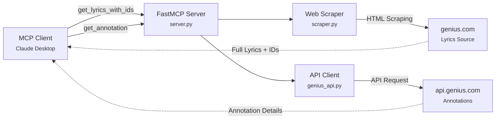

# Genius MCP Server

<div align="center">

[]()
[]()
[]()
[]()

**Retrieve song lyrics and annotations from Genius.com through the Model Context Protocol**

</div>

---

## Overview

The Genius MCP Server enables AI assistants like Claude to fetch complete song lyrics and detailed annotations from Genius.com. Perfect for music analysis, lyric interpretation, and understanding the stories behind your favorite songs.

### How It Works



### Architecture Approach

| Component            | Method        | Reason                                 |
| -------------------- | ------------- | -------------------------------------- |
| **Lyrics Retrieval** | HTML Scraping | Genius API doesn't provide full lyrics |
| **Annotations**      | Official API  | Reliable, structured annotation data   |

## Features

<table>
<tr>
<td width="50%">

### Complete Lyrics Extraction
- Full song lyrics with line-by-line accuracy
- Embedded annotation IDs for context
- Search for song/artist 

</td>
<td width="50%">

### Annotation Retrieval
- Detailed lyric explanations
- Context and meaning breakdown
- Community-sourced insights

</td>
</tr>
</table>

## Quick Start

### Prerequisites

- **Python 3.12 or higher**
- **Genius API Account** (free)

### Installation

#### Step 1: Get Your Genius API Token

1. Visit [Genius API Clients](https://genius.com/api-clients)
2. Log in or create a free Genius account
3. Click **"New API Client"**
4. Fill in the required fields:
   - **App Name**: Choose any name (e.g., "MCP Lyrics Tool")
   - **App Website URL**: Can use `http://localhost` for personal use
   - **Redirect URI**: Can use `http://localhost/callback`
5. Click **"Save"** to create your app
6. On the app page, find and copy your **"Client Access Token"**

#### Step 2: Install Dependencies

```bash
pip install mcp httpx beautifulsoup4 lxml
```

Or using `uv`:

```bash
uv pip install mcp httpx beautifulsoup4 lxml
```

#### Step 3: Configure Your MCP Client

Add to your MCP configuration file:

**Configuration:**

```json
{
  "mcpServers": {
    "genius": {
      "command": "python",
      "args": ["/path/to/genius-mcp/server.py"],
      "env": {
        "GENIUS_API_TOKEN": "your_token_here"
      }
    }
  }
}
```

**Alternative: Using `uvx` (recommended)**

```json
{
  "mcpServers": {
    "genius": {
      "command": "uvx",
      "args": [
        "--python", "3.12",
        "--from", "git+https://github.com/your-username/genius-mcp",
        "genius-mcp"
      ],
      "env": {
        "GENIUS_API_TOKEN": "your_token_here"
      }
    }
  }
}
```

#### Step 4: Restart Your MCP Client

1. Completely quit Claude Desktop (or your MCP client)
2. Relaunch the application
3. The Genius tools should now appear in your tool list

### 🎉 You're Ready!

Try asking Claude:
- "Show me the lyrics for 'Bohemian Rhapsody' by Queen"
- "Explain the meaning behind the first verse of 'Stan'"

## Usage

### Available Tools

#### 1. `get_lyrics_with_ids`

Retrieve complete song lyrics with embedded annotation IDs.

**Parameters:**

| Parameter     | Type   | Required | Description                     |
| ------------- | ------ | -------- | ------------------------------- |
| `song_name`   | string | Yes      | Song title (flexible matching)  |
| `artist_name` | string | Yes      | Artist name (flexible matching) |

**Example Request:**
```python
get_lyrics_with_ids(
    song_name="Rap God",
    artist_name="Eminem"
)
```

**Example Response:**
```
Rap God by Eminem
============================================================

"Look, I was gonna go easy on you" [ID: 2310153]
And I'm only going to get this one chance

"Something's wrong, I can feel it" [ID: 2310156]
(Six minutes—, six minutes—) [ID: 2310030]

"I'm beginning to feel like a Rap God, Rap God" [ID: 2310045]
All my people from the front to the back nod, back nod
...
```

**Features:**
- 🔍 Fuzzy matching for song/artist names
- 📝 Full lyrics with proper formatting
- 🔗 Annotation IDs embedded inline
- 📊 Clean, readable output

---

#### 2. `get_annotation`

Retrieve detailed explanations for annotation IDs (batch processing).

**Parameters:**

| Parameter        | Type         | Required | Description                               |
| ---------------- | ------------ | -------- |-------------------------------------------|
| `annotation_ids` | List[int]    | Yes      | List of annotation IDs (set in config.py) |

**Example Request:**
```python
get_annotation(annotation_ids=[2310153, 2310156])
```

**Example Response:**
```json
[
  {
    "annotation_id": 2310153,
    "lyric": "Look, I was gonna go easy on you",
    "explanation": "Eminem opens the track by acknowledging that he was considering going easy on his competition, but he's decided against it. This sets up the entire premise of the song where he's about to demonstrate his lyrical prowess and speed.",
    "success": true
  },
  {
    "annotation_id": 2310156,
    "lyric": "Something's wrong, I can feel it",
    "explanation": "This line creates an ominous atmosphere, suggesting Eminem senses something amiss. It's a dramatic build-up before he unleashes his technical abilities.",
    "success": true
  }
]
```

---

#### 3. `search_songs`

Search for songs on Genius by title, artist, or lyrics fragment.

**Parameters:**

| Parameter | Type | Required | Description                          |
| --------- | ---- | -------- | ------------------------------------ |
| `query`   | string | Yes    | Search query (song/artist/lyrics)    |
| `limit`   | int    | No     | Number of results (default: 5, max: 10) |

**Example Request:**
```python
search_songs(query="lose yourself", limit=3)
```

**Example Response:**
```json
[
  {
    "id": 53164,
    "title": "Lose Yourself",
    "artist": "Eminem",
    "url": "https://genius.com/Eminem-lose-yourself-lyrics",
    "thumbnail": "https://images.genius.com/...",
    "release_date": "2002-10-28"
  },
  {
    "id": 98745,
    "title": "Lose Yourself (Remix)",
    "artist": "Eminem",
    "url": "https://genius.com/...",
    "thumbnail": "https://images.genius.com/..."
  }
]
```
## Installation
   ```bash
   git clone https://github.com/your-username/genius-mcp.git
   cd genius-mcp
   ```

**Set up a virtual environment and install dependencies:**
    
    
   **Using uv:**
   ```bash
   # Install uv if you haven't already
   curl -LsSf https://astral.sh/uv/install.sh | sh
   
   # Create venv and install dependencies
   uv venv
   source .venv/bin/activate  # On Windows: .venv\Scripts\activate
   uv pip install -e .
   ```

   **Or with pip:**
   ```bash
   python -m venv .venv
   source .venv/bin/activate  # On Windows: .venv\Scripts\activate
   pip install -e .
   ```

### Testing with MCP Inspector

The MCP CLI provides a built-in inspector for testing:

```bash
# From the project root
mcp dev src/server.py
```

---

## Resources

- [Model Context Protocol Documentation](https://modelcontextprotocol.io/)
- [FastMCP Framework](https://github.com/jlowin/fastmcp)
- [Genius Web API Reference](https://docs.genius.com/)

---

<div align="center">

**Made with ❤️ for the MCP community**

[⭐ Star this repo](https://github.com/or-ben-harosh/spotify-mcp) if you find it useful!
</div>
