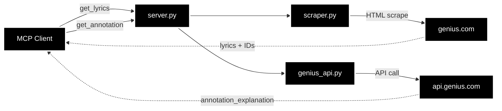

# Genius MCP Server
> **MCP server for song lyrics and annotation retrieval from Genius.com**

[]()
[]()
[]()



**Approach:**
- **Lyrics**: HTML scraping (API doesn't provide full lyrics)
- **Annotations**: Official API (reliable, structured data)

## Features

- **Complete Lyrics Extraction** - Scrapes full song lyrics with annotation ids
- **API Annotations** - Reliable explanations via Genius API per annotation id

## Quick Start

### 1. Get Your Genius API Token
```bash
# Visit: https://genius.com/api-clients
# Create new client → Copy "Client Access Token"
```

### 2. Install Dependencies
```bash
pip install mcp httpx beautifulsoup4
```

### 3. Configure & Run
```bash
# Set your token
export GENIUS_API_TOKEN="your_token_here"

# Start the MCP server
python server.py
```

## Available MCP Tools

### 1. `get_lyrics_with_ids(song_name, artist_name)`
Get complete song lyrics with annotation IDs embedded inline.

**Parameters:**
- `song_name` (string): Song title (flexible - handles variations)
- `artist_name` (string): Artist name (flexible)

**Returns:**
```
Rap God
============================================================

"Look, I was gonna go easy on you" [ID: 2310153]

"But I'm only going to get this one chance" [ID: 2310156]

(Six minutes—, six minutes—) [ID: 2310030]
```

### 2. `get_annotation(annotation_id)`
Retrieve specific annotation explanation by ID.

**Parameters:**
- `annotation_id` (string): The annotation ID from lyrics (e.g., "2310153")

**Returns:**
```json
{
  "annotation_id": "2310153",
  "lyric": "Look, I was gonna go easy on you",
  "explanation": "Eminem opens the track acknowledging that he was considering going easy on his competition..."
}
```
