# 🎵 Genius Lyrics MCP Server

> **Professional MCP server for intelligent song annotation retrieval from Genius.com**

[]()
[]()
[]()

## 🚀 Overview

This MCP server provides AI assistants with intelligent access to Genius.com's extensive database of song annotations and lyrics explanations. Built with enterprise-grade error handling and optimized for LLM consumption.

## 🏗️ Architecture & Flow

```mermaid
graph TD
    A[🤖 MCP Client<br/>Claude/GPT] -->|"Tool Call"| B[🎵 MCP Server<br/>mcp_server.py]
    B -->|"Search Song"| C[🔍 Genius API<br/>genius_api.py]
    B -->|"Get Annotations"| D[🕷️ Web Scraper<br/>scraper.py] 
    C -->|"Song Metadata"| B
    D -->|"Annotations"| B
    B -->|"Clean JSON"| A
    
    E[⚙️ Utils & Config<br/>utils.py, config.py] -.->|"Support"| B
    
    style A fill:#e1f5fe
    style B fill:#f3e5f5
    style C fill:#e8f5e8
    style D fill:#fff3e0
    style E fill:#fafafa
```



<details>
<summary>📱 Simple Text Diagram (click to expand)</summary>

```
🤖 MCP Client (Claude/GPT)
    │
    │ Tool Call: search_songs("Bohemian Rhapsody")
    ▼
🎵 mcp_server.py
    ├─► 🔍 genius_api.py ──── Search & Get Metadata
    ├─► 🕷️ scraper.py ─────── Extract Annotations  
    └─► ⚙️ utils.py ────────── Validation & Errors
    │
    │ Clean JSON Response
    ▼
🤖 MCP Client gets structured data
```

</details>

**Quick Flow:** Client → Server → API/Scraper → Clean Response

## ⚡ Features

- 🔍 **Intelligent Song Search** - Fuzzy matching with artist and title
- 📝 **Complete Annotation Extraction** - All lyric explanations and interpretations  
- 🔄 **Auto-pagination** - Handles 100+ annotations seamlessly
- 🛡️ **Robust Error Handling** - Graceful failures with detailed error context
- 🧠 **LLM-Optimized Output** - Clean JSON structure designed for AI consumption
- ⚡ **High Performance** - Async operations with connection pooling

## 🚦 Quick Start

### 1. Get Your Genius API Token
```bash
# Visit: https://genius.com/api-clients
# Create new client → Copy "Client Access Token"
```

### 2. Install Dependencies
```bash
pip install -r requirements.txt
```

### 3. Configure & Run
```bash
# Set your token in environment or pass as parameter
export GENIUS_ACCESS_TOKEN="your_token_here"

# Start the MCP server
python mcp_server.py
```

## 🔧 Available MCP Tools

### 1. 🔍 `search_songs`
Find songs on Genius with flexible search.

**Parameters:**
- `query` (string): Search term (song title, artist, or lyrics fragment)
- `limit` (int): Number of results (1-20, default: 5)

### 2. 📝 `get_lyrics_with_ids` 
Get song lyrics with annotation IDs embedded inline.

**Parameters:**
- `song_name` (string): Song title
- `artist_name` (string): Artist name

### 3. 💡 `get_annotation`
Retrieve specific annotation explanation by ID.

**Parameters:**
- `annotation_id` (string): The annotation ID from lyrics

### 4. 📊 `get_server_stats`
Get server health and performance statistics.

**Parameters:** None

**Example Response:**
```json
{
  "song": {
    "title": "Bohemian Rhapsody", 
    "artist": "Queen",
    "lyrics": "Is this the real life? [annotation_id:12345]..."
  },
  "annotations": [
    {
      "id": "12345",
      "lyric": "Is this the real life?",
      "explanation": "Mercury opens with existential questioning..."
    }
  ]
}
```

## 🛡️ Error Handling

Enterprise-grade error management with detailed context:

```json
{
  "error": "Song not found for search criteria",
  "song_name": "Unknown Song",
  "artist_name": "Unknown Artist",
  "suggestions": ["Check spelling", "Try alternative artist name"]
}
```

**Handled Scenarios:**
- ❌ Song not found
- ⏰ API timeouts  
- 🔑 Invalid authentication
- 🌐 Network failures
- 📊 Rate limiting

## 🏆 Why This Architecture?

**✅ Separation of Concerns**: Each module has a single, clear responsibility  
**✅ Maintainable**: Simple structure scales without complexity  
**✅ Testable**: Components can be tested in isolation  
**✅ Reliable**: Comprehensive error handling at every layer  
**✅ Performance**: Efficient async operations and connection reuse  

## 📦 Dependencies

- **`mcp[cli]`** - Model Context Protocol framework
- **`httpx`** - Modern async HTTP client  
- **`beautifulsoup4`** - HTML parsing for annotation extraction
- **`python-dotenv`** - Environment variable management
- **`lxml`** - Fast XML/HTML processing backend

## 📊 Performance

- **Search Response**: ~200-500ms
- **Full Annotations**: ~1-3s (depending on song complexity)
- **Memory Usage**: ~15-30MB baseline
- **Concurrent Requests**: Supports multiple simultaneous requests

---

**Built with ❤️ for the AI assistant ecosystem**
