# 🎵 Genius MCP Server

> **MCP server for song lyrics and annotation retrieval from Genius.com**

[]()
[]()
[]()

## 🚀 Overview

This MCP server provides access to Genius.com's of song annotations and lyrics explanations. 

## 🏗️ Architecture & Flow

```mermaid
graph TD
    A[🤖 MCP Client<br/>Claude/GPT] -->|"get_lyrics_with_ids()"| B[🎵 MCP Server<br/>server.py]
    A -->|"get_annotation(id)"| B
    
    B -->|"Scrape HTML"| C[🕷️ Lyrics Scraper<br/>scraper.py]
    B -->|"Fetch Annotation"| D[🔍 Genius API<br/>genius_api.py]
    
    C -->|"HTML"| E[🌐 genius.com<br/>Song Page]
    D -->|"API Call"| F[🔌 api.genius.com<br/>/referents/ID]
    
    E -->|"Lyrics + IDs"| C
    F -->|"Annotation JSON"| D
    
    C -->|"Lyrics with [ID: xxx]"| B
    D -->|"Explanation JSON"| B
    
    B -->|"Clean Response"| A
    
    style A fill:#e1f5fe
    style B fill:#f3e5f5
    style C fill:#fff3e0
    style D fill:#e8f5e8
    style E fill:#fafafa
    style F fill:#fafafa
```



<details>
<summary>📱 Simple Text Diagram (click to expand)</summary>

```
🤖 MCP Client (Claude/GPT)
    │
    ├─► Tool 1: get_lyrics_with_ids("Rap God", "Eminem")
    │   └─► 🎵 server.py
    │       └─► 🕷️ scraper.py
    │           └─► 🌐 genius.com/Eminem-rap-god-lyrics
    │               └─► HTML → Parse lyrics → Extract annotation IDs
    │                   └─► Returns: "lyrics text [ID: 123] more lyrics [ID: 456]"
    │
    └─► Tool 2: get_annotation("123")
        └─► 🎵 server.py
            └─► 🔍 genius_api.py
                └─► 🔌 api.genius.com/referents/123
                    └─► API Response → Parse JSON
                        └─► Returns: {"lyric": "...", "explanation": "..."}
```

</details>

**Hybrid Approach:**
- **Lyrics**: HTML scraping (API doesn't provide full lyrics)
- **Annotations**: Official API (reliable, structured data)

## ⚡ Features

- 🎤 **Complete Lyrics Extraction** - Scrapes full song lyrics with annotation ids
- 💡 **API Annotations** - Reliable explanations via Genius API per annotation id

## 🚦 Quick Start

### 1. Get Your Genius API Token
```bash
# Visit: https://genius.com/api-clients
# Create new client → Copy "Client Access Token"
```

### 2. Install Dependencies
```bash
pip install mcp httpx beautifulsoup4
```

### 3. Configure & Run
```bash
# Set your token
export GENIUS_API_TOKEN="your_token_here"

# Start the MCP server
python server.py
```

## 🔧 Available MCP Tools

### 1. 🎤 `get_lyrics_with_ids(song_name, artist_name)`
Get complete song lyrics with annotation IDs embedded inline.

**Parameters:**
- `song_name` (string): Song title (flexible - handles variations)
- `artist_name` (string): Artist name (flexible)

**Returns:**
```
Rap God
============================================================

"Look, I was gonna go easy on you" [ID: 2310153]

"But I'm only going to get this one chance" [ID: 2310156]

(Six minutes—, six minutes—) [ID: 2310030]
```

### 2. 💡 `get_annotation(annotation_id)`
Retrieve specific annotation explanation by ID.

**Parameters:**
- `annotation_id` (string): The annotation ID from lyrics (e.g., "2310153")

**Returns:**
```json
{
  "annotation_id": "2310153",
  "lyric": "Look, I was gonna go easy on you",
  "explanation": "Eminem opens the track acknowledging that he was considering going easy on his competition..."
}
```
